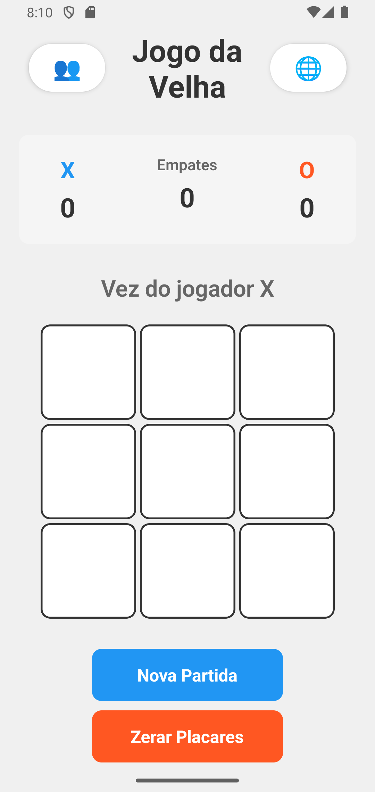
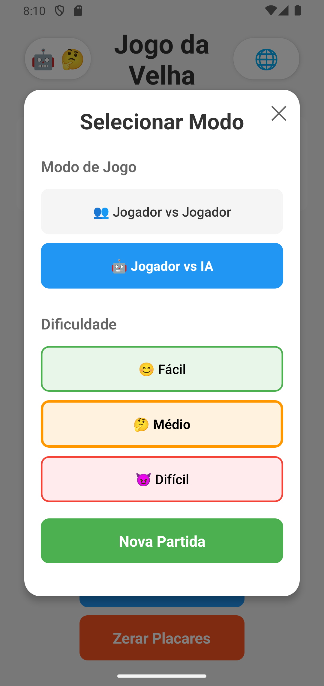
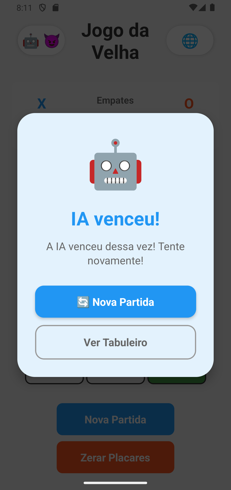
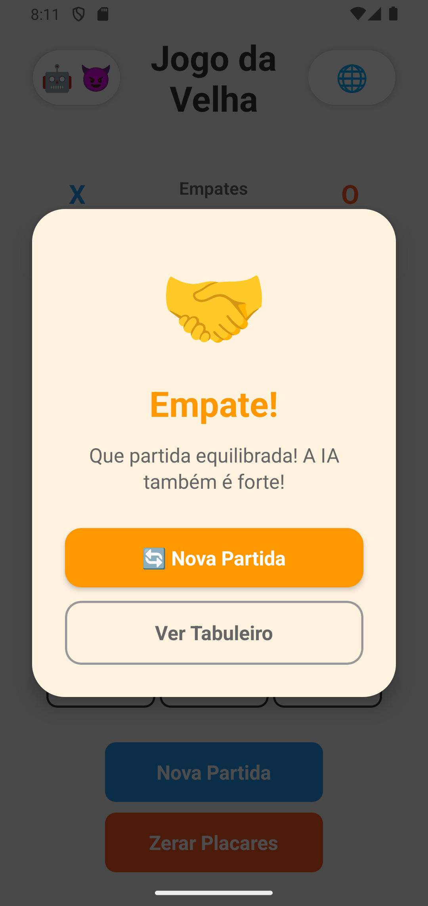
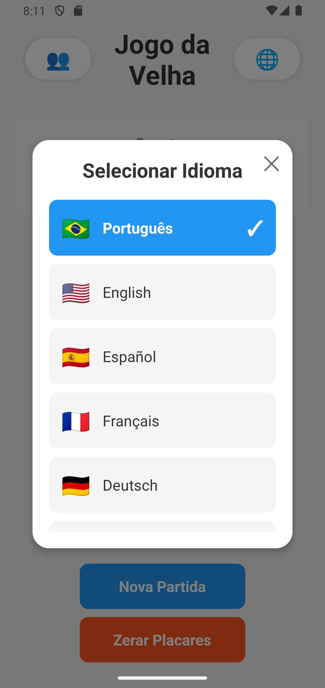

# 🎮 Jogo da Velha - React Native

Um jogo da velha (tic-tac-toe) interativo desenvolvido com React Native, TypeScript e Expo, com suporte a **8 idiomas** e **IA inteligente**.

## 📋 Características

- ✅ Interface intuitiva e responsiva
- ✅ **Suporte a 8 idiomas (i18n)**
- ✅ **IA com 3 níveis de dificuldade**
- ✅ **Modo Jogador vs Jogador e Jogador vs IA**
- ✅ Sistema de pontuação persistente
- ✅ Destaque visual das células vencedoras
- ✅ Detecção automática de vitória e empate
- ✅ Alternância automática entre jogadores
- ✅ **Preferência de idioma salva localmente**
- ✅ TypeScript para type safety
- ✅ Componentização modular

## 📱 Screenshots

<div align="center">
  
  
  
</div>

<div align="center">
  
  
  
</div>

## 🌍 Idiomas Suportados

- 🇧🇷 **Português** (pt-BR)
- 🇺🇸 **English** (en-US)
- 🇪🇸 **Español** (es-ES)
- 🇫🇷 **Français** (fr-FR)
- 🇩🇪 **Deutsch** (de-DE)
- 🇮🇹 **Italiano** (it-IT)
- 🇯🇵 **日本語** (ja-JP)
- 🇨🇳 **中文** (zh-CN)

## 🚀 Tecnologias

- **React Native** - Framework para desenvolvimento mobile
- **TypeScript** - Tipagem estática
- **Expo** - Plataforma de desenvolvimento
- **React Hooks** - Gerenciamento de estado
- **Context API** - Gerenciamento de idioma global
- **AsyncStorage** - Persistência de preferências
- **Algoritmo Minimax** - IA avançada para modo difícil

## 📁 Estrutura do Projeto

```
jogoDaVelha/
├── components/          # Componentes reutilizáveis
│   ├── Board.tsx       # Tabuleiro do jogo
│   ├── Cell.tsx        # Célula individual
│   ├── LanguageSelector.tsx # Seletor de idiomas
│   └── GameModeSettings.tsx # Configurações de modo e dificuldade
├── contexts/           # Contextos React
│   └── LanguageContext.tsx  # Gerenciamento de idioma
├── locales/            # Arquivos de tradução
│   ├── pt-BR.ts        # Português Brasil
│   ├── en-US.ts        # English
│   ├── es-ES.ts        # Español
│   ├── fr-FR.ts        # Français
│   ├── de-DE.ts        # Deutsch
│   ├── it-IT.ts        # Italiano
│   ├── ja-JP.ts        # 日本語
│   ├── zh-CN.ts        # 中文
│   └── index.ts        # Exportação e configuração
├── types/              # Definições de tipos TypeScript
│   └── index.ts        # Tipos do jogo e idiomas
├── utils/              # Funções auxiliares
│   ├── gameLogic.ts    # Lógica do jogo
│   └── aiLogic.ts      # Algoritmos de IA
├── .github/            # Configurações do GitHub
│   └── copilot-instructions.md
├── App.tsx             # Componente principal
└── package.json        # Dependências do projeto
```

## 🎯 Como Usar

### Pré-requisitos

- Node.js (v16 ou superior)
- npm ou yarn
- Expo Go app no seu dispositivo móvel (opcional)

### Instalação

1. Clone o repositório:
```bash
git clone <url-do-repositorio>
cd jogoDaVelha
```

2. Instale as dependências:
```bash
npm install
```

### Executando o Projeto

#### Desenvolvimento Local
```bash
npm start
```

#### Android
```bash
npm run android
```

#### iOS (requer macOS)
```bash
npm run ios
```

#### Web
```bash
npm run web
```

## 🎮 Como Jogar

### Modo Jogador vs Jogador (👥)
1. O jogo começa com o jogador **X**
2. Toque no ícone 👥 no canto superior esquerdo para alternar entre modos
3. Toque em uma célula vazia para fazer sua jogada
4. Os jogadores alternam entre **X** e **O**

### Modo Jogador vs IA (🤖)
1. Toque no ícone do modo (canto superior esquerdo)
2. Selecione **"Jogador vs IA"**
3. Escolha o nível de dificuldade:
   - **😊 Fácil** - IA faz jogadas aleatórias (ótimo para iniciantes)
   - **🤔 Médio** - IA bloqueia vitórias e tenta vencer (desafiador)
   - **😈 Difícil** - IA usa algoritmo Minimax (quase impossível de vencer!)
4. Você sempre joga como **X** (primeiro)
5. A IA joga como **O**

### Recursos Gerais
- Toque no ícone 🌐 para **mudar o idioma**
- Use **"Nova Partida"** para começar um novo jogo
- Use **"Zerar Placares"** para resetar as pontuações
- O primeiro a completar uma linha, coluna ou diagonal vence
- Se todas as células forem preenchidas sem vencedor, é empate

## 🏗️ Componentes

### Board
Gerencia o tabuleiro 3x3 e renderiza as células do jogo.

### Cell
Representa uma célula individual do tabuleiro com:
- Estados visuais diferentes para X e O
- Destaque para células vencedoras
- Desabilitação após jogada

### ScoreBoard
Exibe a pontuação de ambos os jogadores e empates, traduzida no idioma selecionado.

### LanguageSelector
Modal para seleção de idioma com:
- Lista de 8 idiomas disponíveis
- Bandeiras para identificação visual
- Indicador do idioma atual
- Persistência da preferência

### GameModeSettings
Modal para configuração do jogo com:
- Seleção entre modo PvP e PvAI
- Escolha de nível de dificuldade da IA
- Interface intuitiva com emojis
- Confirmação visual das seleções

## 🤖 Sistema de Inteligência Artificial

### Algoritmos Implementados

#### 1. IA Fácil (😊)
**Estratégia**: Jogadas completamente aleatórias
- Escolhe aleatoriamente entre as posições disponíveis
- Não considera estratégia ou bloqueios
- Ideal para iniciantes e crianças
- Taxa de vitória do jogador: ~80-90%

```typescript
// Seleciona uma posição aleatória disponível
export const easyAI = (board: Board): number => {
  const availableMoves = board
    .map((cell, index) => (cell === null ? index : null))
    .filter((index) => index !== null);
  return availableMoves[Math.floor(Math.random() * availableMoves.length)];
};
```

#### 2. IA Média (🤔)
**Estratégia**: Jogo defensivo e oportunista
- **Prioridade 1**: Vencer se houver oportunidade
- **Prioridade 2**: Bloquear vitória iminente do oponente
- **Prioridade 3**: Ocupar o centro se disponível
- **Prioridade 4**: Ocupar cantos estratégicos
- **Prioridade 5**: Qualquer posição disponível
- Taxa de vitória do jogador: ~40-60%

```typescript
export const mediumAI = (board: Board, aiPlayer: Player): number => {
  // 1. Tentar vencer
  const winningMove = findWinningMove(board, aiPlayer);
  if (winningMove !== -1) return winningMove;

  // 2. Bloquear oponente
  const blockingMove = findWinningMove(board, opponent);
  if (blockingMove !== -1) return blockingMove;

  // 3. Centro > Cantos > Bordas
  // ...
};
```

#### 3. IA Difícil (😈)
**Estratégia**: Algoritmo Minimax (Jogo Perfeito)
- Implementa o algoritmo Minimax clássico
- Avalia todas as possibilidades futuras
- Escolhe sempre a melhor jogada possível
- **Impossível de vencer** (apenas empate ou derrota)
- Profundidade adaptativa para otimização
- Taxa de vitória do jogador: ~0-5% (somente por erro da IA ou jogada perfeita)

```typescript
// Minimax: avalia recursivamente todas as jogadas possíveis
const minimax = (
  board: Board,
  depth: number,
  isMaximizing: boolean,
  aiPlayer: Player,
  opponent: Player
): number => {
  // Verifica condições de término (vitória, derrota, empate)
  // Retorna pontuação ajustada pela profundidade
  // Maximiza para IA, minimiza para oponente
  // Retorna melhor jogada encontrada
};
```

### Características Técnicas

- **Delay inteligente**: IA "pensa" por 300ms-800ms para melhor UX
- **Indicador visual**: Mostra "IA pensando..." durante processamento
- **Bloqueio de interação**: Previne jogadas durante turno da IA
- **Otimização de performance**: Minimax com poda de profundidade
- **Jogadas instantâneas**: Mesmo em modo difícil, resposta < 1s

### Detalhes do Minimax

O algoritmo Minimax é uma técnica de teoria dos jogos que:

1. **Simula todas as jogadas possíveis** até o fim do jogo
2. **Atribui pontuações**:
   - +10 para vitória da IA (ajustado pela profundidade)
   - -10 para vitória do oponente (ajustado pela profundidade)
   - 0 para empate
3. **Assume jogo perfeito** de ambos os lados
4. **Escolhe o caminho** que maximiza a pontuação da IA

**Por que é imbatível?**
- Explora TODAS as ~362,880 possibilidades do jogo
- Sempre escolhe a jogada que leva ao melhor resultado possível
- No jogo da velha, com jogo perfeito, sempre termina em empate

## 🌐 Sistema de Internacionalização

### Arquitetura i18n

O jogo usa um sistema robusto de internacionalização baseado em:

1. **Context API** - Gerenciamento global do idioma
2. **AsyncStorage** - Persistência da preferência do usuário
3. **Traduções modulares** - Arquivo separado para cada idioma

### Como Adicionar um Novo Idioma

1. Crie um arquivo em `/locales` (ex: `locales/ru-RU.ts`):
```typescript
export default {
  title: 'Крестики-нолики',
  playerXWins: 'Игрок X выиграл!',
  playerOWins: 'Игрок O выиграл!',
  draw: 'Ничья!',
  playerTurn: 'Ход игрока',
  newGame: 'Новая игра',
  resetScores: 'Сбросить счет',
  draws: 'Ничьи',
  language: 'Язык',
  selectLanguage: 'Выбрать язык',
};
```

2. Importe e adicione em `locales/index.ts`:
- **Nunca usar textos hardcoded - sempre usar sistema de tradução**
- **Usar `useLanguage()` hook para acessar traduções**
```typescript
import ruRU from './ru-RU';

export const translations = {
  // ... outros idiomas
  'ru-RU': ruRU,
};

export const AVAILABLE_LANGUAGES = [
  // ... outros idiomas
  { code: 'ru-RU', name: 'Русский', flag: '🇷🇺' },
];
```

3. Atualize o tipo em `types/index.ts`:
```typescript
export type SupportedLanguage = 'pt-BR' | 'en-US' | ... | 'ru-RU';
```

### Uso no Código

```typescript
import { useLanguage } from './contexts/LanguageContext';

function MeuComponente() {
  const { t, language, setLanguage } = useLanguage();
  
  return (
    <Text>{t.title}</Text>
  );
}
```
## 🏗️ Componentes

### Board
Gerencia o tabuleiro 3x3 e renderiza as células do jogo.

### Cell
Representa uma célula individual do tabuleiro com:
- Estados visuais diferentes para X e O
- Destaque para células vencedoras
- Desabilitação após jogada

### ScoreBoard
Exibe a pontuação de ambos os jogadores e empates.

## 🧩 Lógica do Jogo

### Funções Principais (utils/gameLogic.ts)

- `checkWinner()` - Verifica se há um vencedor
- `checkDraw()` - Verifica se o jogo terminou em empate
- `createEmptyBoard()` - Cria um novo tabuleiro vazio
- `togglePlayer()` - Alterna entre os jogadores

## 🎨 Personalização

Você pode personalizar cores e estilos editando os arquivos:
- [App.tsx](App.tsx) - Estilos principais
- [components/Cell.tsx](components/Cell.tsx) - Estilos das células
- [components/ScoreBoard.tsx](components/ScoreBoard.tsx) - Estilos do placar

## 📝 Convenções de Código

- Componentes funcionais com Hooks
- Nomes de componentes em PascalCase
- Funções auxiliares em camelCase
- Todas as props e estados tipados
- Interfaces para tipos customizados
- Comentários em português para documentação

## 🤝 Contribuindo

Contribuições são bem-vindas! Sinta-se à vontade para:
1. Fazer fork do projeto
2. Criar uma branch para sua feature
3. Commit suas mudanças
4. Push para a branch
5. Abrir um Pull Request

## 📄 Licença

Este projeto é de código aberto e está disponível sob a licença MIT.

## 👤 Autor

Desenvolvido com ❤️ usando React Native e Expo

---

**Divirta-se jogando! 🎉**
